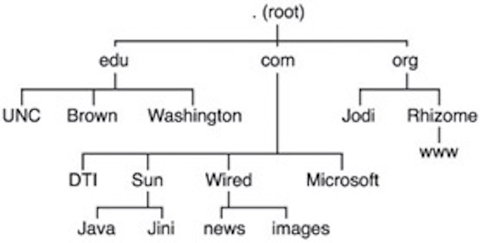
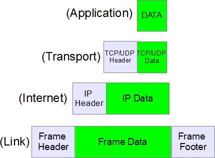
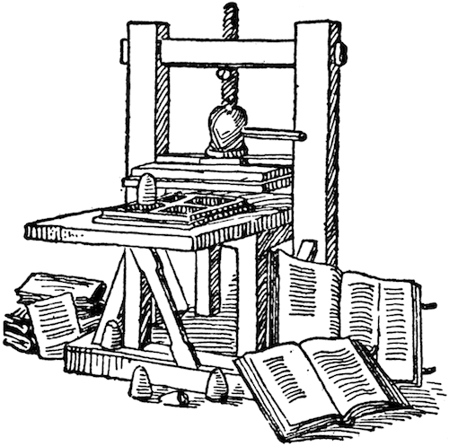

## Protocol, Ch 1: Physical Media
### Major Studio I - 9/15/15

## Contents

This book is about | what it means | do I cover it?
------------- | ------------- | ----
a diagram | distributed network | yes
a technology | computer | yes
a management style | protocological control | not so much

## Outline
- Key Concepts
  - Periodization
  - Definitions of Protocol
- Chapter 1: Physical Media
  - Network Diagrams
    - Centralized
    - Decentralized
    - Distributed
  - Protocol Layers
    - Link
    - Internet
    - Transport
    - Interlude: DNS
    - Application
- Questions

## Key Concepts

## Periodization

Period | Machine | Diagram | Manager
--- | --- | --- | ---
Sovereign society | Mechanical | Centralized Network | Hierarchy
Disciplinary society | Thermodynamic | Decentralized Network | Bureaucracy
Control society | Cybernetic (Computer) | Distributed Network | Protocol

## Definitions of Protocol
- (p.6) A computer protocol is a set of recommendations and rules that outline specific technical standards. 

- (p.8) Protocol is a distributed management system that allows control to exist within a heterogeneous material milieu.

- (p.30) Protocol is not by nature horizontal or vertical, but [it] is an algorithm, a *proscription for structure* whose form of appearance my be any number of different diagrams or shapes.

## Physical Media

## Network Diagrams

## 
<!-- .slide: data-background="white url('networks.png') center no-repeat" data-background-size="contain" data-background-repeat="no-repeat" -->

## Centralized Network
- "A single central power point (a host), from which are attached radial nodes. The central point is connected to all of the satellite nodes, which are themselves connected only to the central host." (p.11)

## 
<!-- .slide: data-background="url('panopticon.jpg') center no-repeat" data-background-size="contain" data-background-repeat="no-repeat" -->

## Decentralized Network
- "A multiplication of the centralized network" (p.31)
-	"Multiple central hosts, each with its own set of satellite nodes. A satellite node may have connectivity with one or more hosts, but not with other nodes." (p.11)

## 
<!-- .slide: data-background="black url('airtraffic.png') center no-repeat" data-background-size="contain" data-background-repeat="no-repeat" -->

## Distributed Network
- "Each point is neither a central hub nor a satellite node, but an intelligent end-point system" (p.11)
- "Each end-point system can communicate with any host it chooses" (Ibid.)
- "Communicating nodes must speak the same language" (p.12)

## 
<!-- .slide: data-background="white url('interstates.png') center no-repeat" data-background-size="contain" data-background-repeat="no-repeat" -->

## Rules Inside Rules for the Network of Networks: Protocol Layers
- The content of every new protocol is always another protocol (p. 10)
- Division of labor: Each layer...
  - doesn't care what the one above it does
  - assumes the ones below it are working
  - only implements behaviour it needs

## 
Layer | What it does | Ex. Protocol
--- | --- | ---
Application | Process & display content | HTTP
Transport | Make sure data is in the right place in one piece | TCP
Internet | Route packets from A to B via the interstate | IP / ICMP
Link | Make the physical connection work | DSL, USB

## Link Layer
- Transmission and reception of raw bit streams over a physical medium
- Physical and Data Link layers included
- Closest to the metal / fiber

## 
Layer | What it does | Ex. Protocol
--- | --- | ---
Application | Process & display content | HTTP
Transport | Make sure data is in the right place in one piece | TCP
Internet | Route packets from A to B via the interstate | IP / ICMP
Link | Make the physical connection work | DSL, USB

## Internet Layer (IP / ICMP)
- Move packets of data from A to B. 
- No concern for content (application layer) or integrity (transport layer)
- Does Routing
  - How to get from A to B over the Internet-Interstate
- "Hopping" along a chain of nodes it asks for the way 
  - Each node knows all its neighbours and gives the closest
- "Connects the Call"
- "The engine without the steering wheel"

## traceroute demo

## 
Layer | What it does | Ex. Protocol
--- | --- | ---
Application | Process & display content | HTTP
Transport | Make sure data is in the right place in one piece | TCP
Internet | Route packets from A to B via the interstate | IP / ICMP
Link | Make the physical connection work | DSL, USB

## Transport Layer (TCP)
- Checks if the message arrives in one piece
- "Are you still there?" and "Did you understand me?"

## ...wait!
### How did traceroute know to ask 103.235.46.39 for www.baidu.com?

## Domain Name System
- The Internet needs a phone book
  - Initially, it was just that: hosts.txt on a single computer

even today: /etc/hosts

## Instead of One Giant Phonebook: 

### Going to the Department of Domain Retrieval for www.parsons.edu
Part | Find
--- | ---
. | Department Building
edu | Section for .edu Domains
parsons | Office of Parsons, next to NYU
www | Desk of the www person

## How Does It Really Work?

## Implications
- The "centralized achilles heel"
- DNS Root Zone is under U.S. control
  - Now being transferred to multi-stakeholder model (2014)

## 
<!-- .slide: data-background="white url('turkey-dns.png') center no-repeat" data-background-size="contain" data-background-repeat="no-repeat" -->

## Application Layer (HTTP)

## Quick Review

## Questions

## Is The Internet Inherently Liberating or Inherently Oppresive?

## Hint
 <!-- .element class="stretch" -->

## What is a Diagram?
- "A diagram is a map, or rather several superimposed maps." (Gilles Deleuze, Foucault, p.44) 
- Deleuze calls the "diagram or abstract machine ... the map of relations between forces, a map of destiny, or intensity, which...acts as a non-unifying immanent cause which is coextensive with the whole social field. The abstract machine is like the cause of the concrete assemblages that execute its relations; and these relations take place 'not above' but within the very tissue of the assemblages they produce." (Deleuze, Foucault, p. 37)

## Do We Live in a Control Society?
- Protocol is how control exists after decentralization (p.8)
  - _after_: the historical moment after decentralization has come into existence
  - _after_: the historical phase _after_ decentralization, that is, after it is dead and gone, replaced as the supreme social management style by the diagram of distribution
  - "There are many decentralized networks in the word today - in fact, decentralized networks are the most common diagram of the modern era."

...so, do we live in a Control Society?

Maybe rather discuss...

## The Why and How of Periodization

